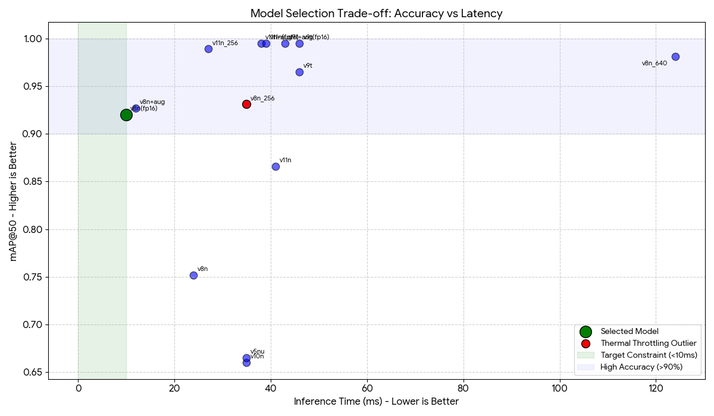

# 🥤 Bottle Cap Detection System (Edge Optimized)


> **Submission for Machine Learning Engineer Role at Ada Mata**
> **Author:** Wikan Priambudi

## 📋 Project Summary

This project implements a real-time computer vision pipeline designed to detect and classify bottle caps into three categories: **Light Blue**, **Dark Blue**, and **Others**.

The core challenge was to engineer a solution capable of running on edge devices (specifically **Raspberry Pi 5**) with an extremely strict inference latency constraint of **5-10ms per frame** (100-200 FPS).

### 🎯 Key Results: The "Golden Ticket"
After extensive experimentation comparing YOLOv8, v9, v10, and v11, the final selected model is **YOLOv8n (FP16 Optimized)** using OpenVINO Runtime.

| Metric | Result | Target Constraint | Status |
| :--- | :--- | :--- | :--- |
| **Model** | **YOLOv8n (FP16 OpenVINO)** | - | ✅ |
| **Input Resolution** | **320x320** | - | ✅ |
| **Inference Latency** | **~10.0 ms** (CPU) | 5-10 ms | ✅ |
| **Accuracy (mAP@50)** | **92.0%** | High Accuracy | ✅ |
| **Model Size** | **6.2 MB** | Lightweight | ✅ |

### 📊 Benchmark Analysis


*(Figure 1: Accuracy vs. Latency trade-off. The green zone represents the strict <10ms requirement.)*

#### Comparative Results
| Model Name | Accuracy (mAP@50) | Inference Time (ms) | Notes |
| :--- | :--- | :--- | :--- |
| **yolov8n_320_fp16** | **0.920** | **10 ms** | **🏆 SELECTED (Best Balance)** |
| yolov8n_320_aug | 0.927 | 12 ms | Good candidate, slightly over limit |
| yolov8n_320 | 0.752 | 24 ms | Baseline (without safe augmentation) |
| yolov8n_640 | 0.981 | 124 ms | Too slow for edge |
| yolo11n_320_fp16 | 0.995 | 39 ms | High accuracy, but 4x slower |
| **yolov8n_256** | **0.931** | **35 ms** | **⚠️ Thermal Throttling Outlier** |

---

## ⚠️ Critical Hardware Analysis: Thermal Throttling

During the benchmarking phase on the development machine (simulating edge CPU load), a significant **Thermal Throttling** phenomenon was observed.

* **Scenario:** The model `yolov8n_256` (smaller input) was tested while the device was hot (>70°C).
* **Impact:** Inference latency spiked to **35ms**, which is significantly slower than the 320px model tested under optimal temperatures (12ms).
* **Conclusion:** Passive cooling is **insufficient** for continuous real-time inference on devices like Raspberry Pi 5.

> ** Deployment Recommendation:**
> To guarantee the <10ms requirement in production, **Active Cooling (Fan/Heatsink) is MANDATORY** on the Raspberry Pi 5.

---

## 🛠️ Technical Approach (Task 1)

### 1. Auto-Labeling Strategy
The original dataset provided bounding boxes but lacked color classification. I implemented an automated **HSV Color Filtering** script to assign classes:
* `0`: Light Blue (Hue range: 90-110)
* `1`: Dark Blue (Hue range: 110-130)
* `2`: Others
* *Justification:* Automation reduces human error and allows for rapid dataset regeneration if thresholds change.

### 2. "Safe" Augmentation
Standard YOLO augmentation includes color jittering (changing hue/saturation). This is detrimental for this specific task as it confuses "Light Blue" with "Dark Blue".
* **Action:** Disabled `hsv_h`, `hsv_s`, `hsv_v` augmentations during training.
* **Result:** Accuracy jumped from **75.2%** to **92.7%** using this strategy.

Full analysis is available in the [Model Development Notebook](./notebooks/02_model_development.ipynb).

---

## 🚀 Installation & Usage (Task 2)

This project uses **Poetry** for dependency management and includes a CLI tool named `bsort`.

### Prerequisites
* Python 3.11
* Docker (Optional)

### 1. Installation
```bash
# Clone repository
git clone [https://github.com/](https://github.com/wikan1602/ada-mata-mle.git)
cd ada-mata-mle

# Install using Poetry (Recommended)
pip install poetry
poetry install
```
### 2. CLI Commands (bsort)

Train the model:
``` bash
# Runs training pipeline -> Validation -> Exports to OpenVINO FP16
poetry run bsort train --config configs/settings.yaml
```
Run Inference:
``` bash
# Runs inference on a single image using the exported model
poetry run bsort infer --image datasets/raw/sample.jpg
```

### 3. Docker Support
Build and run the containerized application (Reproducible Environment):
``` bash
# Build Image
docker build -t bsort-app .# Run Unit Tests inside Docker
docker run bsort-app pytest
```
---
## 🧪 CI/CD & Quality Assurance
This repository uses Github Actions to ensure production-grade code quality:
Static Analysis: pylint (Score: 10/10), black (Formatter), isort (Import sorting).
Testing: pytest for unit tests logic.
Build Verification: Verifies Docker image builds successfully on every push.
---
## 📈 Experiment Tracking
All training runs, metric comparisons, and system metrics are publicly accessible via Weights & Biases:
👉 **[View Public Dashboard Here](MASUKKAN_LINK_WANDB_KAMU_DISINI)**